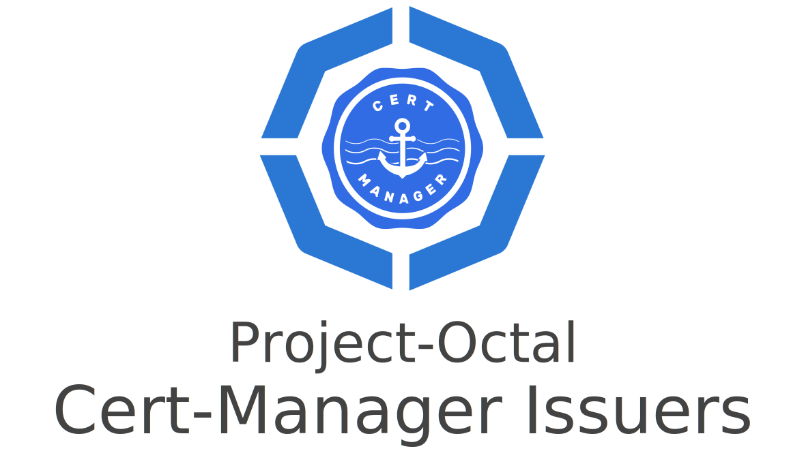

---

Simplifies the deployment and management of Jetstacks cert-manager certificate issuers on a Kubernetes cluster.

### TODO:
- Add support for the latest version of Cert Manager. 

---

### Example
```hcl-terraform
module "cert_manager_issuers" {
  source = "github.com/project-octal/terraform-kubernetes-cert-manager-issuers"
  version = "v0.1.0"
  
  namespace = data.terraform_remote_state.kube_infra_workspace.outputs.cert_manager_namespace

  certificate_issuers = {
    letsencrypt = {
      name              = "letsencrypt-prod"
      server            = "https://acme-v02.api.letsencrypt.org/directory"
      email             = "dylanturn@gmail.com"
      secret_base64_key = var.letsencrypt_secret_base64_key
      default_issuer : true,
      ingress_class = module.traefik.ingress_class
    }
  }
}
```

<!-- BEGIN_TF_DOCS -->
## Requirements

No requirements.

## Providers

No providers.

## Modules

| Name | Source | Version |
|------|--------|---------|
| <a name="module_letsencrypt_issuer"></a> [letsencrypt\_issuer](#module\_letsencrypt\_issuer) | ./letsencrypt | n/a |

## Resources

No resources.

## Inputs

| Name | Description | Type | Default | Required |
|------|-------------|------|---------|:--------:|
| <a name="input_letsencrypt"></a> [letsencrypt](#input\_letsencrypt) | n/a | <pre>object({<br>    name : string,<br>    server : string,<br>    email : string,<br>    secret_base64_key : string,<br>    default_issuer : bool,<br>    ingress_class : string<br>  })</pre> | `null` | no |
| <a name="input_namespace"></a> [namespace](#input\_namespace) | n/a | `string` | n/a | yes |

## Outputs

| Name | Description |
|------|-------------|
| <a name="output_default_issuer"></a> [default\_issuer](#output\_default\_issuer) | This will be a decision tree. I should probably chop it down before it grows too large... |
<!-- END_TF_DOCS -->